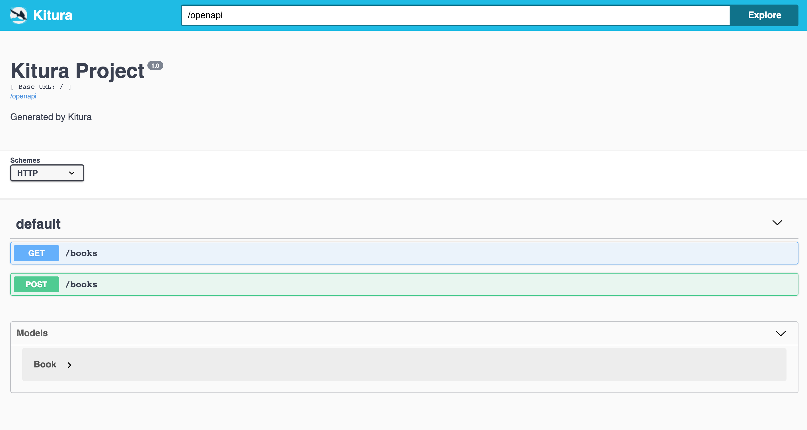
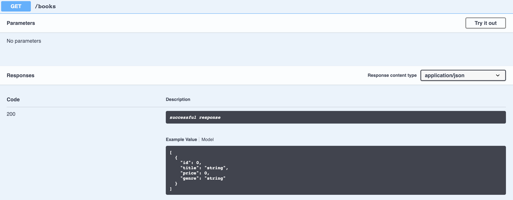
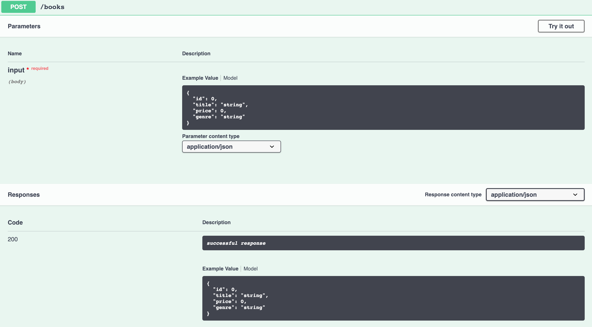
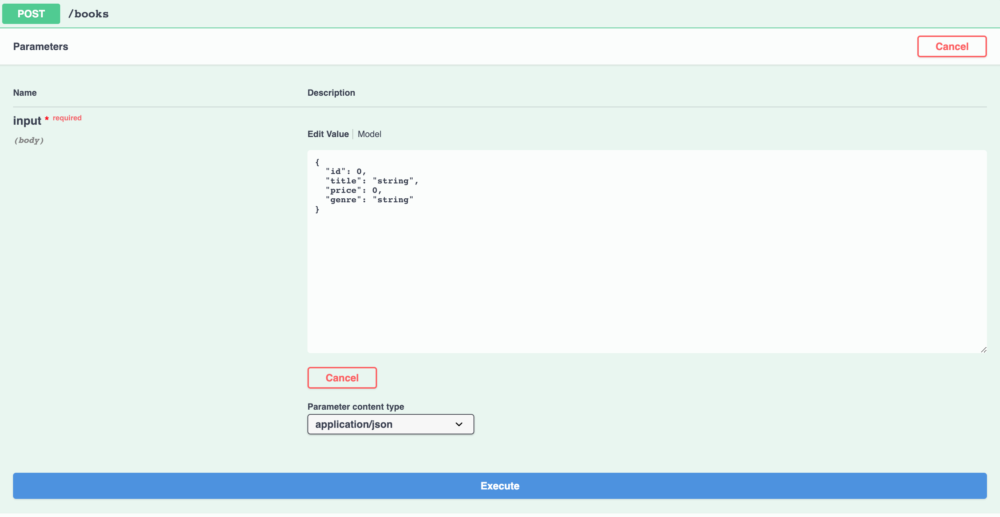
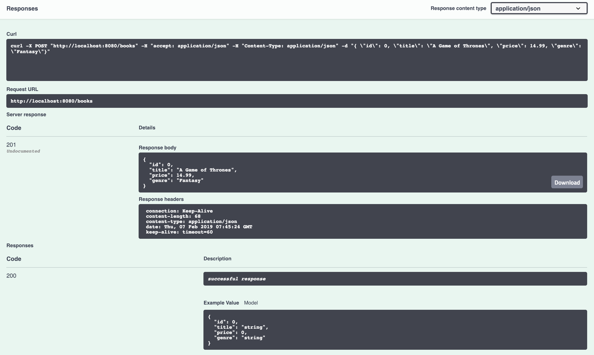
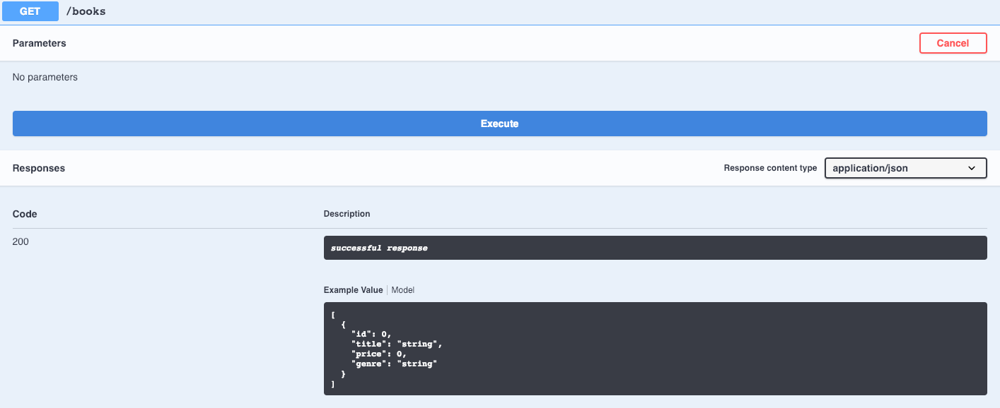
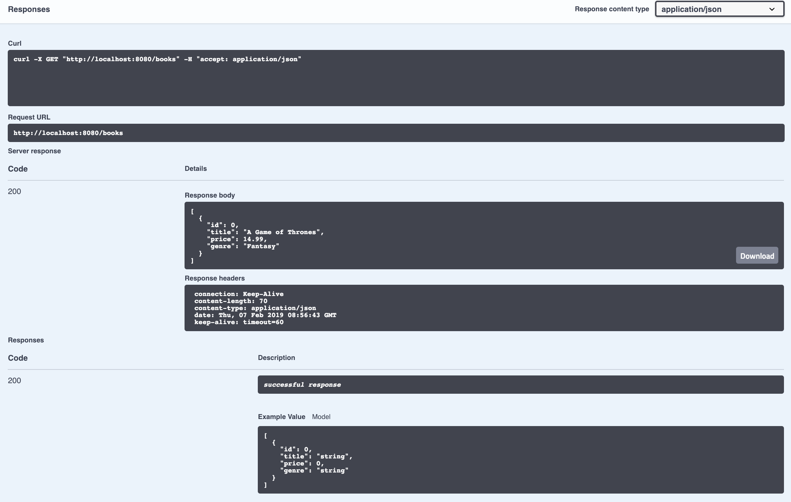

# Kitura OpenAPI

[Kitura-OpenAPI](https://github.com/Kitura/Kitura-OpenAPI) is a library which makes it easy to add [OpenAPI](https://www.openapis.org), also known as Swagger, support to your Codable routing-based Kitura application.

In this guide we show you how to host both an automatically generated OpenAPI definition of your application on the endpoint `"/openapi"`, and the Swagger UI tool on the endpoint `"/openapi/ui"`. We also demonstrate how simple this makes testing your routes!

---

## Prerequisites

*   [Codable Routes:](./codable-routing) Follow the Codable Routing guide to create endpoints to test with OpenAPI.

---

## Step 1: Add Kitura OpenAPI to your project

First we need to [add OpenAPI to our dependencies](https://github.com/Kitura/Kitura-OpenAPI#getting-started).

Next, we need to import KituraOpenAPI into our project.

Open your `Application.swift` file:
```
open Sources/Application/Application.swift
```

Add the import statement for the KituraOpenAPI package:
```swift
import KituraOpenAPI
```

Next we need to add the KituraOpenAPI endpoints to our router.

Inside the `postInit()` function add:
```swift
KituraOpenAPI.addEndpoints(to: router)
```

That's all we need to do to enable KituraOpenAPI on our server.

>By default, KituraOpenAPI is served on the `"/openapi"` and `"/openapi/ui"` paths.

---

## Step 2: View the OpenAPI UI

We need to start our Kitura server first.

Once the server has started, navigate to: <a href="http://localhost:8080/openapi/ui" target="blank">localhost:8080/openapi/ui</a>

You should see a screen similar to the following:



Kitura OpenAPI provides a UI in which we can view our Codable routes and models.

We can view any of our routes simply by clicking on them.

Let's start by clicking on the `GET` button:



We can see here the parameters section is empty, as we'd expect because GET routes typically only retrieve data.

However we can see an example of the response we should be getting from the GET route on `"/books"`.

>As this is a GetAll route it's an array of JSON objects that match our Book model.

Next we can view the POST route by clicking the `POST` button:



We can see from this screen what input the `POST` on `"/books"` is expecting, and OpenAPI even provides an example.

Information regarding the parameter type is also provided, application/json in our case.

As well as being able to view the expected input we can also view the expected response.

>POST routes typically respond with the data that was posted, so in this case the expected request input is the same as the response.

Kitura OpenAPI also allows us to test our Codable routes in a very simple way.

In the next sections we will look at how we can test our Codable routes.

---

## Step 3: Test a POST route

We can test the POST route by clicking the `POST` button, then clicking the `Try it out` button in the top right:



Kitura OpenAPI provides an editable value for us to POST some custom data.

Let's populate the field with some meaningful data:


Now that we have some data that we want to post, we can click execute.

Once that's complete we should see the following:



At the top of this responses section Kitura OpenAPI provides us with the Curl command to excute via the command line.

>If you followed the Codable routing guide you will notice this looks very similar to how we tested our POST route.

Next we can see the request URL, that is, the URL on which this request was made as defined in our application code.

We can also view the response body, the information the server responds to the request with, as well as all of the response headers.

Finally we can see the HTTP response code from the server, 201 in our case, which in HTTP terms means 'Created'.

Now that we've posted some data, we can test retrieving the data.

---

## Step 4: Test a GET route

To test our GET route we need to click on the `GET` button and then click `Try it out` in the top right corner.

We should see the following:



As this is a `GET` route we don't need to provide any data therefore we can just click execute:



This should look somewhat familiar as it's similiar to the result of our POST test.

We're provided with the Curl command which we could execute in a terminal.

The response body is slightly different, it is an array of JSON objects which is what we'd expect from the `GetAll` route.

The status code is also different, we have a value of 200 which means `Success`.

---

## Next steps

[Databases:](../databases/what-are-databases) Learn about databases and the database providers Kitura supports.
